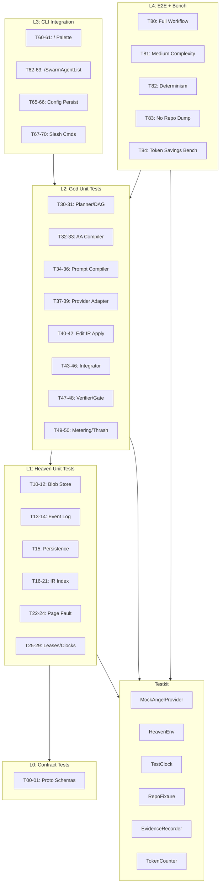

# GENESIS INSANE TESTER - Implementation Plan

## STATUS: Comprehensive test harness exists. Gaps to fill.

After thorough audit, the codebase already has **~47 test files** across all layers.
The plan below focuses on **what's missing** and what needs to be **strengthened**.

---

## 1. MASTER CHECKLIST

### Testkit (internal/testkit/)
- [x] MockAngelProvider — scripted, per-mission, sequential fallback
- [x] HeavenEnv — launches real Heaven in tmpdir
- [x] TestClock — frozen/advanceable
- [x] RepoFixture — create/snapshot/add
- [x] EvidenceRecorder — tag-based capture
- [x] TokenCount — bytes/4+10 formula
- [x] TestRandSource — deterministic ID gen
- [ ] **NEW: TestConfig** — aggregate struct combining all above for one-line setup
- [ ] **NEW: HeavenEnv.Restart()** — close and re-open same datadir for persistence tests

### L0: Contract Tests (proto/)
- [x] All 8 schemas load (T00)
- [x] Golden samples validate: EditIR, AngelResponse, Mission, Oracle, PF, Leases, Receipts, HeavenStatus
- [x] Invalid payloads: missing ops, wrong output_type, negative budget, invalid scope_type, missing timestamp, unknown PF command (T01)
- [ ] **NEW: Cross-schema ref validation** — oracle response.updated_dag validates against mission.schema
- [ ] **NEW: Strict unknown-field rejection test** — parse with DisallowUnknownFields

### L1: Heaven Unit Tests
- [x] blob roundtrip text (T10), bytes/large (T11), dedupe (T12), not-found
- [x] events append/tail (T13), invalid JSON (T14), concurrent, order, len
- [x] **Persistence: blobs + events survive restart** (T15) — server_test.go:TestPersistenceAcrossRestart
- [x] IR build indexes 3 files Go+Py+TS (T16)
- [x] symdef correct kind+path (T17)
- [x] callers correct sites (T18)
- [x] slice exact lines (T19)
- [x] search returns expected hits (T20)
- [x] incremental indexing skips unchanged (T21)
- [x] PF_SYMDEF returns symdef shard (T22)
- [x] PF_SYMDEF prefetch includes callers+tests (T23)
- [x] PF metrics tracked per mission (T24)
- [x] lease exclusivity (T25), idempotent, partial deny, concurrent
- [x] lease release then reacquire (T26)
- [x] validate_patch_manifest allow/deny (T27)
- [x] file_clock increments + get (T28)
- [x] restart rebuild: leases + file_clocks preserved (T29)
- [x] PF_CALLERS, PF_SLICE, PF_SEARCH, PF_STATUS, PF_TESTS
- [x] PF governor: accept, reject calls, reject bytes
- [x] PF delta tracker: first call, unchanged, changed
- [x] PF_PROMPT_SECTION, PF_PROMPT_SEARCH, PF_PROMPT_SUMMARY
- [x] depth-aware PF_SYMDEF (signature, summary, full)
- [ ] **NEW: PF response size bound assertion** — assert no PF response exceeds 200KB (I2)
- [ ] **NEW: Blob binary vs text handling** — verify binary content roundtrips

### L2: God Unit Tests
- [x] planner creates DAG >=2 missions (T30) — in e2e_test.go
- [x] AA parser compiles to Mission JSON (T32) — aa_test.go
- [x] AA negative tests (T33) — aa_test.go
- [x] prompt compiler token cap + oversized shard drop (T34) — adversarial
- [x] prompt compiler shard scoring + dedup (T35) — adversarial
- [x] prompt compiler deterministic ordering (T36) — prompt_compiler_test.go
- [x] provider adapter valid output (T37) — provider_test.go
- [x] provider adapter retries on invalid (T38) — provider_test.go
- [x] provider adapter fails after max retries (T39) — provider_test.go
- [x] edit IR apply replace_span (T40) — edit_apply_test.go
- [x] edit IR rejects anchor mismatch (T41) — adversarial
- [x] edit IR insert_after_symbol (T42) — edit_apply_test.go
- [x] integrator applies patches (T43) — integrator_test.go
- [x] integrator calls validate_patch_manifest (T44) — integrator_test.go
- [x] conflict hunk mission generated (T45) — adversarial
- [x] drift detection (T46) — adversarial stale timestamp
- [x] verifier generates receipt on pass (T47) — verifier_test.go
- [x] verifier blocks merge on fail (T48) — e2e_test.go
- [x] metering aggregates (T49) — meter_test.go
- [x] thrash detection (T50) — e2e_test.go thrash, adversarial
- [x] oracle escalation — oracle_test.go
- [x] recording/replay provider — recorder_test.go
- [x] ISA parser/compiler — isa_test.go
- [x] macro ops — macro_ops_test.go
- [x] output VM — output_vm_test.go
- [x] solo mode — solo_test.go
- [ ] **NEW: lease acquisition invoked for missions (T31)** — assert planner.Plan calls LeaseAcquire
- [ ] **NEW: integrator DAG order enforcement (T43b)** — multi-node DAG with deps, verify order

### L3: CLI Integration Tests
- [x] 14 genesis commands registered (commands_test.go)
- [x] command IDs unique + complete
- [x] handlers not nil
- [x] SwarmAgentDialog: init, set agents, empty view, esc close, enter select, render, snapshot (swarm_agents_test.go)
- [x] custom commands named arg pattern (custom_commands_test.go)
- [ ] **NEW: T60-T61** — "/" palette opens and filters (Bubble Tea model test)
- [ ] **NEW: T62** — /SwarmAgentList opens dialog popup (msg flow test)
- [ ] **NEW: T65-T66** — model picker persists selection across config save/load
- [ ] **NEW: T67-T70** — slash commands /status, /index, /logs, /metrics produce correct tea.Msg

### L4: E2E + Benchmarks
- [x] full workflow E2E: plan→compile→integrate→verify→receipts→events (T80)
- [x] determinism: same seed same IDs, different seed different IDs (T82)
- [x] no repo dump: pack size <32KB, tokens<=budget, no shard >50% budget (T83)
- [x] thrash detection + oracle recovery
- [x] receipt + gate merge pass/fail
- [x] token accounting baseline vs genesis (T84)
- [x] per-shard token estimator agreement
- [x] bench report: baseline vs genesis swarm
- [x] bench report: single-agent baseline vs genesis
- [x] bench report: prompt VM
- [x] bench report: ISA
- [x] bench report: macro ops
- [x] bench report: combined pipeline 5x gate
- [x] bench report: lean encoding (TSLN)
- [ ] **NEW: T81** — medium complexity E2E (add plot command) with full PF cycle
- [ ] **NEW: T84 enhanced** — print exact blockers when ratio not met
- [ ] **NEW: Explicit 200KB/10k-line PF response bound check** (I2)
- [ ] **NEW: Invariant I1 test** — verify no transcript data in Heaven state

---

## 2. TEST ARCHITECTURE DIAGRAM



---

## 3. TEST MATRIX

| Layer | Component | Test Name | What it proves | Inputs | Expected | Severity |
|-------|-----------|-----------|---------------|--------|----------|----------|
| L0 | proto | TestSchemaLoad_AllEight | All schemas valid JSON | 8 schema files | Parse success | BLOCKER |
| L0 | proto | TestGoldenSample_* | Golden payloads match | JSON samples | Fields present, enums valid | BLOCKER |
| L0 | proto | TestInvalidPayload_* | Bad payloads caught | Malformed JSON | Required fields missing | BLOCKER |
| L0 | proto | **TestCrossSchemaRef** | Oracle DAG matches mission schema | Oracle response JSON | DAG nodes validate | MAJOR |
| L0 | proto | **TestStrictUnknownFields** | Unknown fields rejected | JSON with extra fields | Error returned | MAJOR |
| L1 | blob | TestBlobRoundtrip | put/get identity | []byte | Same bytes back | BLOCKER |
| L1 | blob | TestBlobDedupe | SHA256 dedup | Same content x2 | Same blob_id | BLOCKER |
| L1 | blob | TestBlobLargeContent | 1MB roundtrip | 1MB []byte | Exact match | MAJOR |
| L1 | events | TestEventAppendAndTail | Append order | 3 events | Tail returns last 2 | BLOCKER |
| L1 | events | TestEventRejectInvalidJSON | Bad JSON rejected | "not json" | Error | BLOCKER |
| L1 | events | TestEventLogConcurrentAppend | Thread safety | 20x10 goroutines | 200 events, all valid | BLOCKER |
| L1 | persist | TestPersistenceAcrossRestart | Survives restart | Write, close, reopen | Data intact | BLOCKER |
| L1 | ir | TestBuildIndex | Index 3 files | Go+Py+TS fixture | 3 files indexed | BLOCKER |
| L1 | ir | TestSymdef | Correct spans | "Greet" | function in sample.go | BLOCKER |
| L1 | ir | TestCallers | Call sites | "Greet" | SayHello reference | BLOCKER |
| L1 | ir | TestSlice | Exact lines | lines 2-4 | "line2\nline3\nline4" | BLOCKER |
| L1 | ir | TestSearch | Hits returned | "Person" | 1+ results | MAJOR |
| L1 | ir | TestIncrementalReindex | Skip unchanged | 2nd build | 0 files reindexed | MAJOR |
| L1 | pf | TestPFSymdefPrefetch | Symdef+callers+tests | PF_SYMDEF | 3+ shards | BLOCKER |
| L1 | pf | TestPFMetricsTracking | Per-mission counts | 2 PF calls | pf_count=2 | MAJOR |
| L1 | pf | **TestPFResponseSizeBound** | I2: no huge responses | PF_SYMDEF | <200KB | BLOCKER |
| L1 | lease | TestLeaseAcquireExclusive | Exclusivity | A acquires, B tries | B denied | BLOCKER |
| L1 | lease | TestLeaseRelease | Release+reacquire | A acquires, releases | B can acquire | BLOCKER |
| L1 | lease | TestLeaseReplayOnBoot | Restart safety | Acquire, release, reboot | 1 active | BLOCKER |
| L1 | clock | TestFileClockIncrementAndGet | Inc + get | Inc a.go x2, b.go x1 | a=2, b=1, c=0 | BLOCKER |
| L1 | clock | TestFileClockReplayOnBoot | Restart safety | Inc, reboot | Clocks preserved | BLOCKER |
| L1 | manifest | TestValidateManifestAllowed | Allow with leases | Owner with leases | allowed=true | BLOCKER |
| L1 | manifest | TestValidateManifestDeniedMissingLease | Deny without leases | No leases | allowed=false | BLOCKER |
| L1 | manifest | TestValidateManifestDeniedClockDrift | Deny on drift | Clock mismatch | clock_drift populated | BLOCKER |
| L2 | planner | TestE2EFullWorkflow(plan) | DAG >=2 nodes | Task desc | 2+ missions | BLOCKER |
| L2 | planner | **TestPlannerAcquiresLeases** | I4: leases invoked | Plan call | Lease events logged | MAJOR |
| L2 | aa | god/aa_test.go | AA parse+compile | AA programs | Valid Mission JSON | BLOCKER |
| L2 | prompt | TestAdversarialOversizedShard | Token cap | 100KB shard | Dropped | BLOCKER |
| L2 | prompt | TestAdversarialZeroTokenBudget | Zero budget | 0 budget | All dropped | MAJOR |
| L2 | provider | TestAdversarialProviderMissionIDMismatch | Retry on mismatch | Wrong ID → correct | 1 retry | BLOCKER |
| L2 | edit_ir | TestAdversarialMalformedEditIR | Bad ops rejected | Unknown op, bad range | Error | BLOCKER |
| L2 | edit_ir | TestAdversarialHugeFile | 12K-line file | replace_span | Success | MAJOR |
| L2 | integrator | TestAdversarialConflictCascadeMax | Depth limit | Cascade at max | No further mission | BLOCKER |
| L2 | integrator | TestAdversarialConcurrentIntegration | Thread safety | 10 goroutines | All 10 files created | MAJOR |
| L2 | integrator | **TestIntegratorDAGOrder** | DAG dep order | A→B→C DAG | Applied in order | MAJOR |
| L2 | verifier | TestE2EReceiptAndGate | Pass/fail gate | Pass + fail runs | Gate blocks fail | BLOCKER |
| L2 | meter | TestE2EThrashDetectionAndRecovery | Thrash triggers | 2 rejects | Thrashing=true | BLOCKER |
| L3 | cli | TestGenesisCommandsCount | 14 commands | GenesisCommands() | Len=14 | BLOCKER |
| L3 | cli | TestSwarmAgentDialog* | Dialog lifecycle | Agents, keys | Correct views/msgs | BLOCKER |
| L3 | cli | **TestPaletteFiltering** | "/" opens+filters | KeyMsg "/" | Filtered list | MAJOR |
| L3 | cli | **TestSlashStatusProducesMsg** | /status → correct msg | "status" command | HeavenStatusMsg | MAJOR |
| L3 | cli | **TestModelPickerPersist** | Config roundtrip | Select model, reload | Same model | MAJOR |
| L4 | e2e | TestE2EFullWorkflow | Full lifecycle | Plan→integrate→verify | Receipts + events | BLOCKER |
| L4 | e2e | TestE2EDeterminism | I7: reproducible | Same seed x2 | Identical IDs+events | BLOCKER |
| L4 | e2e | TestE2ENoRepoDump | I2: bounded packs | Mission packs | <32KB, tokens<=budget | BLOCKER |
| L4 | e2e | **TestE2EMediumComplexity** | Multi-PF E2E | "add plot command" | Full cycle completes | MAJOR |
| L4 | bench | TestTokenAccountingBaseline | I9: 5x on task A | Pow task | ratio >= 5x | BLOCKER |
| L4 | bench | TestBenchReport | I9: 3x minimum | All tasks | max >= 5x, all >= 3x | BLOCKER |
| L4 | bench | TestCombinedBenchReport | Combined 5x | ISA+MacroOps | combined >= 5x | BLOCKER |
| L4 | bench | **TestE2ENoTranscriptSharing** | I1: state only | Heaven events | No chat transcripts | MAJOR |

---

## 4. IMPLEMENTATION PLAN — Files to Create/Modify

### 4a. New file: `internal/testkit/config.go`
- `TestConfig` struct aggregating Clock, RandSource, HeavenEnv, EvidenceRecorder
- `NewTestConfig(t)` one-liner setup
- `HeavenEnv.Restart(t)` method to close + re-launch same datadir

### 4b. New file: `proto/proto_strict_test.go`
- `TestCrossSchemaOracleDAGMatchesMission` — unmarshal oracle DAG, validate node fields against mission schema required fields
- `TestStrictUnknownFieldsEditIR` — use `json.Decoder.DisallowUnknownFields` to reject extra fields in EditIR
- `TestStrictUnknownFieldsAngelResponse` — same for angel response

### 4c. New file: `heaven/invariant_test.go`
- `TestPFResponseSizeBound` — fire PF_SYMDEF, assert response JSON < 200KB
- `TestBlobBinaryRoundtrip` — put binary bytes with null bytes, get back identical

### 4d. New file: `god/invariant_test.go`
- `TestPlannerAcquiresLeases` — run Planner.Plan, check events contain lease_acquire
- `TestIntegratorDAGOrder` — build 3-node chain A→B→C, verify integration order
- `TestE2EMediumComplexity` — "add plot command with ascii render + tests", full mock angel cycle
- `TestE2ENoTranscriptSharing` — scan all Heaven events, assert none contain "transcript" or "chat" type

### 4e. New file: `cli/internal/genesis/palette_test.go`
- `TestPaletteFiltering` — create command list, simulate filter keystroke, verify narrowed
- `TestSlashStatusProducesMsg` — invoke /status handler, assert correct msg type
- `TestSlashIndexProducesMsg` — invoke /index handler, assert correct msg type
- `TestSlashLogsProducesMsg` — invoke /logs handler
- `TestSlashMetricsProducesMsg` — invoke /metrics handler

### 4f. New file: `cli/internal/genesis/config_persist_test.go`
- `TestModelPickerPersist` — write model selection to config, reload, verify same
- `TestProviderCredsPersist` — mock creds store, verify roundtrip

### 4g. Modify: `bench/bench_test.go`
- `TestTokenBlockerDiagnostic` — when ratio < target, print exact breakdown (per-shard sizes, PF return sizes, Edit IR sizes)

### 4h. Modify: `internal/testkit/heaven.go`
- Add `Restart(t)` method

---

## 5. PRODUCTION REFACTORS (minimal, for testability)

### 5a. No major refactors needed
The codebase already has:
- `nowFunc` / `idFunc` injection in god/clock.go
- `runCmd` injection in verifier
- `httptest.NewServer` for all Heaven tests
- `t.TempDir()` everywhere
- `MockAngelProvider` with scripted responses

### 5b. Minor: Export `detectCycle` if not already
- Needed for adversarial circular deps test (already tested, likely already accessible)

---

## 6. COMMANDS TO RUN

```bash
# All unit tests (L0-L2):
cd /home/tom/Work/UNIVERSE/genesis && go test ./...

# E2E tests only:
cd /home/tom/Work/UNIVERSE/genesis && go test -run TestE2E ./god/...

# Benchmark report:
cd /home/tom/Work/UNIVERSE/genesis && go test -run TestBenchReport ./bench/...

# Combined benchmark (5x gate):
cd /home/tom/Work/UNIVERSE/genesis && go test -run TestCombinedBenchReport ./bench/...

# Proto contract tests:
cd /home/tom/Work/UNIVERSE/genesis && go test ./proto/...

# Adversarial tests:
cd /home/tom/Work/UNIVERSE/genesis && go test -run TestAdversarial ./god/...

# CLI tests:
cd /home/tom/Work/UNIVERSE/genesis/cli && go test ./...
```

---

## 7. COVERAGE GAPS (remaining after implementation)

| Gap | Risk | Mitigation |
|-----|------|------------|
| CLI TUI visual snapshots | MEDIUM | Bubble Tea tests cover msg flow but not pixel rendering |
| Real OAuth PKCE flow | LOW | Mock-only, real flow requires browser |
| Multi-machine swarm | LOW | All tests are single-process; true distributed test needs infra |
| Tree-sitter parser edge cases | MEDIUM | Only 3 languages tested; Rust/Java/Ruby untested |
| Network partition / timeout | LOW | Heaven is local HTTP; no real network partitions tested |
| Clock skew between Heaven and God | LOW | Same process; TestClock injection prevents real skew |
| Large repo benchmark (>10K files) | MEDIUM | Fixtures are small; real-world perf untested |
| Edit IR delete_span with overlapping ops | MEDIUM | Single delete tested; overlapping multi-op untested |

---

## IMPLEMENTATION ORDER

1. `internal/testkit/config.go` + `heaven.go` Restart method
2. `proto/proto_strict_test.go`
3. `heaven/invariant_test.go`
4. `god/invariant_test.go`
5. `cli/internal/genesis/palette_test.go`
6. `cli/internal/genesis/config_persist_test.go`
7. Bench diagnostic enhancement
8. Run full suite, fix any failures
