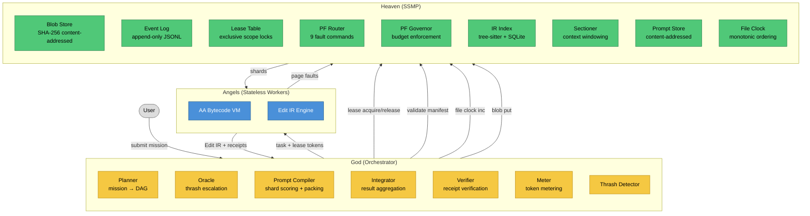
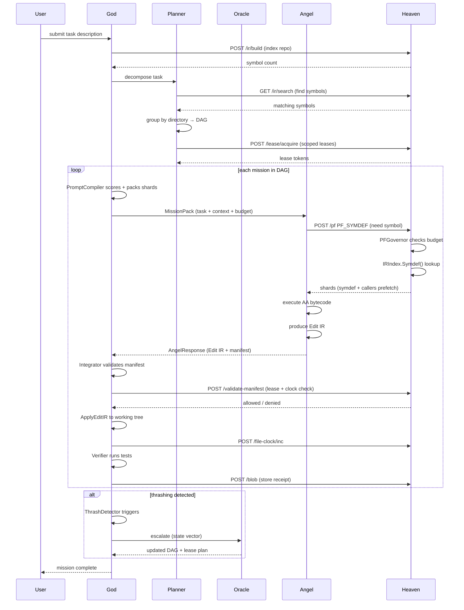
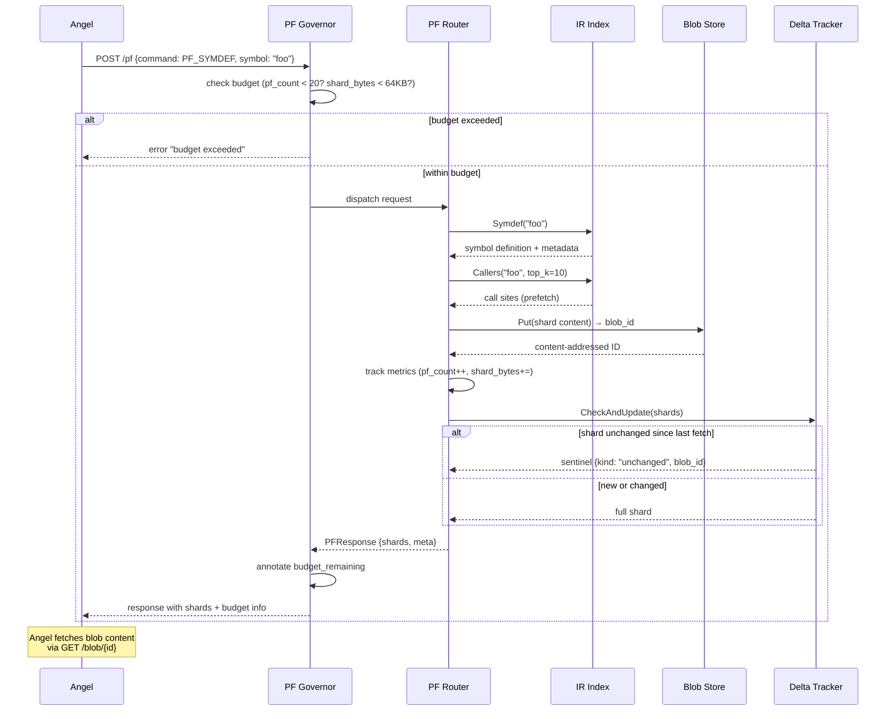
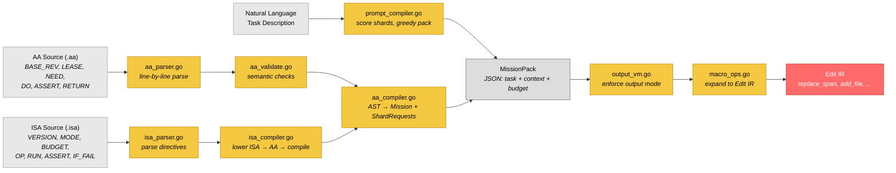
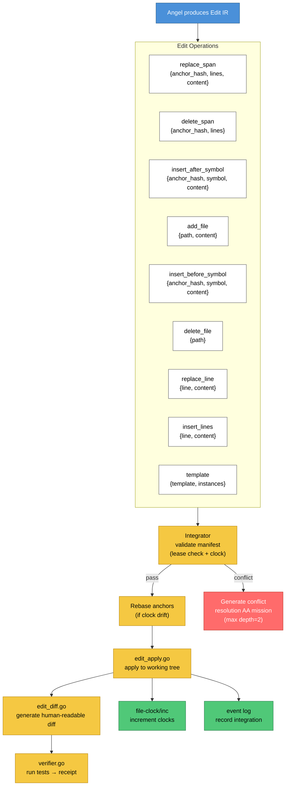
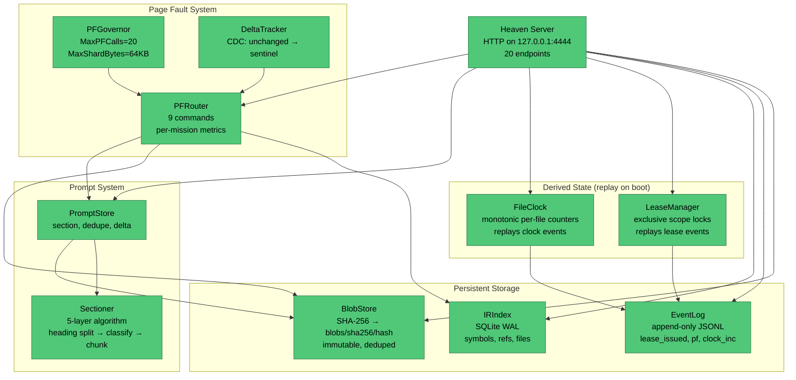
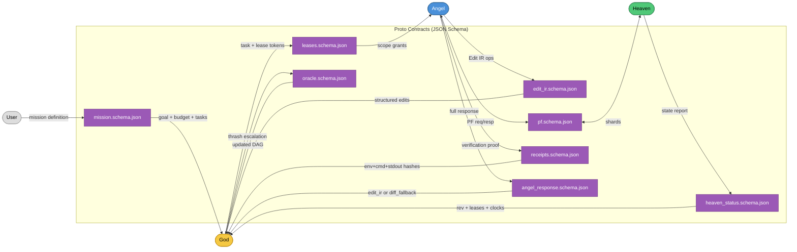

# Genesis SSMP

> Local-first Agent Swarm OS that externalizes memory into a shared-state plane.
> Deterministic replay. Content-addressed edits. Zero private agent state.

Current AI coding agents hold private state. They can't coordinate, can't replay, and can't verify each other's work. When two agents touch the same file, you get silent conflicts. When an agent crashes, its context is gone. When you ask "why did it change that line?" — there's no audit trail.

Genesis inverts this. **All agent memory is externalized into a content-addressed shared plane called Heaven.** Agents become stateless workers that page-fault into shared memory — exactly like an OS virtual memory system, but for AI agent context. The result: deterministic replay via append-only event logs, transparent coordination via scoped leases, conflict detection via anchor hashes, and token-efficient lazy-loading via the Page Fault protocol.

This is an operating system for agent swarms, not a framework.

## Architecture



### Mission Lifecycle



### Page Fault Protocol



### Angel Assembly Pipeline



### Edit IR Lifecycle



### Heaven Internal Architecture



### Proto Contract Map



> For the full 60-page architecture deep dive, see [architecture.md](./architecture.md).

## Core Concepts

### Heaven (Shared State Memory Plane)

Content-addressed blob store + append-only event log + lease table + file clocks. All agent state lives here. Agents never hold private memory — they page-fault into Heaven. Deterministic replay guaranteed by replaying the event log on boot, reconstructing lease state and file clock vectors from the event stream.

Heaven serves 20 HTTP endpoints: blob CRUD, event append/tail, lease acquire/release/list, file clock get/inc, IR build/symdef/callers/slice/search, page fault dispatch, prompt store/get/section/reconstruct, manifest validation, and status.

### God (Orchestrator)

Receives missions, decomposes into DAGs via the Planner (keyword extraction → IR search → directory bucketing → lease acquisition). Assigns tasks to Angels with scoped leases and token budgets. Manages the full lifecycle: planning → prompt compilation (shard scoring with salience weights: symdef=3.0, callers=1.5, test=2.0) → delegation → validation → integration → verification. Detects thrashing via 4 conditions (PF budget exceeded, patch rejections, conflicts, test failures) and escalates to the Oracle for DAG restructuring.

### Angels (Workers)

Stateless execution units. Receive a MissionPack containing task description, packed context shards, and budget constraints. Read additional context via page faults. Produce Edit IR (structured code modifications) or macro ops (compact opcodes for common transforms like RENAME_SYMBOL, ADD_PARAM). Return verified receipts. Can be killed and restarted without state loss — all state is in Heaven.

### Angel Assembly (AA)

A task DSL compiled from structured directives: `BASE_REV`, `LEASE`, `NEED` (prefetch), `DO` (task), `ASSERT`, `RETURN`. The AA parser validates syntax, the AA compiler produces Mission structs + shard request manifests. The ISA layer adds control flow: `MODE` (SOLO/SWARM), `BUDGET`, `INVARIANT`, `OP`, `RUN`, `IF_FAIL` (RETRY/ESCALATE/HALT). The compilation pipeline: AA source → parser → validator → compiler → ISA lowering → output VM enforcement.

### Edit IR

Content-addressed code modifications with 9 operation types: `replace_span`, `delete_span`, `insert_after_symbol`, `insert_before_symbol`, `add_file`, `delete_file`, `replace_line`, `insert_lines`, `template`. Each span operation carries an anchor hash (SHA-256 of 3 lines before + 3 lines after the edit region) for conflict detection. Edits are verifiable, replayable, and mergeable. On anchor mismatch, the Integrator generates a conflict-resolution AA mission (max depth 2).

### Page Fault Protocol

Lazy-loading model for agent context with 9 commands: `PF_SYMDEF` (symbol definition with depth: full/signature/summary + caller prefetch), `PF_CALLERS` (call sites), `PF_SLICE` (file line range), `PF_SEARCH` (lexical symbol search), `PF_STATUS` (mission metrics), `PF_TESTS` (test metadata), `PF_PROMPT_SECTION`, `PF_PROMPT_SEARCH`, `PF_PROMPT_SUMMARY`. The PF Governor enforces per-mission budgets (MaxPFCalls=20, MaxShardBytes=64KB). The Delta Tracker replaces unchanged shards with sentinels to minimize redundant transfers.

## Proto Contracts

All inter-component messages are defined as JSON Schema in `proto/`:

| Schema | Direction | Purpose |
|--------|-----------|---------|
| `mission.schema.json` | User → God | Mission definition (goal, budget, tasks, leases) |
| `edit_ir.schema.json` | Angel → God | 9 edit operation types with anchor hashes |
| `pf.schema.json` | Angel ↔ Heaven | 9 PF commands, shard responses, budget metadata |
| `receipts.schema.json` | Angel → God | env_hash + command_hash + stdout_hash + exit_code |
| `leases.schema.json` | God → Angel | Scoped access grants (symbol/module/file/directory) |
| `oracle.schema.json` | God internal | Thrash escalation request/response |
| `angel_response.schema.json` | Angel → God | Full response envelope (edit_ir or diff_fallback) |
| `heaven_status.schema.json` | Heaven → God | state_rev, active leases, hotset, file clocks |

All schemas enforce `additionalProperties: false` with strict validation. See `proto/proto_strict_test.go` for cross-schema reference validation.

## Project Structure

```
genesis/
├── god/                        # Orchestrator (35KB source)
│   ├── mission.go              # Mission lifecycle & DAG structure
│   ├── planner.go              # Task → DAG decomposition
│   ├── oracle.go               # Thrash escalation to cloud oracle
│   ├── aa_compiler.go          # Angel Assembly compiler
│   ├── aa_parser.go            # AA directive parser
│   ├── aa_validate.go          # AA semantic validation
│   ├── isa_compiler.go         # ISA → AA lowering + compilation
│   ├── isa_parser.go           # ISA directive parser
│   ├── prompt_compiler.go      # Shard scoring + budget packing
│   ├── edit_apply.go           # Edit IR application engine
│   ├── edit_diff.go            # Human-readable diff generation
│   ├── integrator.go           # Result aggregation + conflict handling
│   ├── verifier.go             # Test execution + receipt generation
│   ├── meter.go                # Token metering + mission metrics
│   ├── recorder.go             # Execution recording for replay
│   ├── provider.go             # LLM provider abstraction
│   ├── solo.go                 # Single-agent execution mode
│   ├── output_vm.go            # Output format enforcement
│   ├── macro_ops.go            # Compact opcode → Edit IR expansion
│   ├── thrash.go               # 4-condition thrash detection
│   ├── heaven_client.go        # God → Heaven HTTP client
│   ├── patch_v1.go             # Legacy patch format support
│   ├── clock.go                # Logical clock
│   └── *_test.go               # 132 tests (20 test files)
├── heaven/                     # Shared State Memory Plane (18KB source)
│   ├── server.go               # HTTP server (20 endpoints)
│   ├── blob.go                 # SHA-256 content-addressed store
│   ├── eventlog.go             # Append-only JSONL event log
│   ├── leases.go               # Exclusive scope lease management
│   ├── pf.go                   # Page Fault router (9 commands)
│   ├── pf_delta.go             # Change data capture for shards
│   ├── pf_governor.go          # PF budget enforcement
│   ├── irindex.go              # Tree-sitter IR indexing (Go/Py/TS)
│   ├── irparse.go              # Tree-sitter AST parsing
│   ├── sectioner.go            # 5-layer prompt sectioning
│   ├── prompt.go               # Prompt store + delta tracking
│   ├── fileclock.go            # Monotonic per-file clock
│   ├── clock.go                # Logical clock
│   └── *_test.go               # 51 tests (8 test files)
├── proto/                      # JSON Schema contracts
│   ├── mission.schema.json
│   ├── edit_ir.schema.json
│   ├── pf.schema.json
│   ├── receipts.schema.json
│   ├── leases.schema.json
│   ├── oracle.schema.json
│   ├── angel_response.schema.json
│   ├── heaven_status.schema.json
│   ├── proto_test.go           # Golden sample validation
│   └── proto_strict_test.go    # Cross-schema + unknown field tests
├── cmd/genesis/                # CLI entrypoint
│   └── main.go                 # init, index, run, status, logs, serve
├── internal/
│   ├── testkit/                # Test infrastructure
│   │   ├── provider.go         # Mock LLM provider
│   │   ├── heaven.go           # Mock Heaven server
│   │   ├── fixtures.go         # Temp repo generation
│   │   ├── clock.go            # Frozen clock
│   │   ├── evidence.go         # Evidence recorder
│   │   └── tokens.go           # Token counting utilities
│   └── lean/                   # TSLN compact encoding
│       ├── tsln.go
│       ├── encoder.go
│       └── decoder.go
├── bench/                      # Benchmark harness
│   ├── *.go                    # Go benchmark framework
│   ├── bench_test.go           # Threshold assertions
│   └── harness/                # Comparative benchmark tooling
│       ├── harness.sh
│       ├── proxy/              # HTTP recording proxy
│       ├── scenarios/          # 7 benchmark scenarios
│       └── *.py                # Analysis scripts
├── fixtures/                   # Test fixtures
│   ├── sample.{go,py,ts}       # Multi-language samples
│   ├── refactor.aa, bugfix.aa  # AA program examples
│   ├── sample.isa              # ISA program example
│   ├── e2e_calc_repo/          # Full E2E test repository
│   └── ir_small_repo_{py,ts}/  # IR indexing test repos
├── cli/                        # TUI interface (forked OpenCode)
├── architecture.md             # Full architecture deep dive
├── PLAN.md                     # Test plan & coverage analysis
├── AUDIT_REPORT.md             # System audit (16/18 pass)
├── BENCHMARK_RESULTS.md        # Performance benchmarks
├── Makefile                    # Build system
├── go.mod                      # Go 1.24 module
└── LICENSE                     # MIT
```

## Design Decisions

**Why externalized state (Heaven) over agent-local memory** — Private agent state is the root cause of non-determinism, coordination failure, and unreplayable executions in multi-agent systems. Externalizing everything into a content-addressed shared plane makes replay trivial (replay the event log), conflicts detectable (anchor hashes), and agent crashes recoverable (all state survives in Heaven).

**Why page faults over eager context loading** — LLM context windows are expensive. Eager loading wastes tokens on irrelevant code. The PF model loads exactly what's needed, when needed — like OS virtual memory but for agent context. The PF Governor prevents thrashing with per-mission budgets (20 calls, 64KB). The Delta Tracker avoids resending unchanged shards.

**Why content-addressed blobs** — Deduplication, integrity verification, and conflict detection all fall out naturally from content-addressing. Anchor hashes on Edit IR operations mean you can detect if the code you're modifying has changed since you read it. Receipts carry env_hash + command_hash + stdout_hash for deterministic verification.

**Why Angel Assembly over raw prompts** — Raw prompts are non-deterministic and opaque. AA programs are structured, parseable, and validatable: `BASE_REV HEAD`, `LEASE symbol:func`, `NEED symdef foo`, `DO refactor`, `RETURN edit_ir`. The ISA layer adds control flow (RETRY, ESCALATE, HALT). The compilation pipeline converts fuzzy intent into verifiable behavior.

**Why JSON Schema contracts (proto/)** — Language-agnostic. Testable. The 8 proto schemas are the API — everything else is implementation. Strict validation (`additionalProperties: false`) catches rogue fields. New Angels in any language just implement the schemas.

**Why tree-sitter for IR indexing** — Fast incremental parsing, language-agnostic AST, battle-tested in every major editor. Supports Go, Python, TypeScript. The IR index gives Heaven structural understanding of code (symbols, call graphs, reference classification) — enabling symbol-level leases, intelligent PF responses, and salience-based shard scoring.

**Why leases over locks** — Leases expire. Locks deadlock. In a system where agents can crash, be killed, or time out, lease-based access control is self-healing. Scoped to symbol/module/file/directory granularity. Same-owner idempotent. Partial grants (some scopes may be denied while others succeed).

**Why Go** — Fast compilation, single binary, goroutines for concurrent Angels, cgo for tree-sitter bindings, and zero runtime dependency hell. SQLite via go-sqlite3 for the IR index. HTTP stdlib for Heaven server.

## Building

```bash
# Prerequisites: Go 1.24+, C compiler (for tree-sitter cgo bindings)

make build     # compile genesis binary
make test      # run all tests
make bench-s1  # run single benchmark scenario
make bench-full # run all benchmark scenarios
make fmt       # format code
make vet       # static analysis
make lint      # fmt + vet
make clean     # remove build artifacts
```

## Test Coverage

Comprehensive test suite across god/, heaven/, proto/, and cli/, all passing:

| Subsystem | Tests | Coverage |
|-----------|-------|----------|
| Heaven (blob, eventlog, leases, PF, IR, prompt, server, invariants) | 51 | Comprehensive: all 9 PF commands, concurrency, persistence, replay |
| God (planner, AA, ISA, prompt compiler, provider, edit IR, integrator, verifier, meter, recorder, oracle, thrash, solo, macro ops, output VM, patch v1) | 132 | Full pipeline: adversarial inputs, E2E workflows, benchmarks, invariants |
| Proto (schema validation, golden samples, strict unknown fields) | 10 | All 8 schemas validated, cross-schema references checked |
| CLI (commands, auth, dialog) | 20 | Command registration, palette filtering |

Test infrastructure in `internal/testkit/`: MockAngelProvider, HeavenEnv (real httptest server), FrozenClock, RepoFixture, EvidenceRecorder, TokenCounter. Tests use real Heaven HTTP servers, not mocks.

See [PLAN.md](./PLAN.md) for the full test plan and coverage gap analysis.

## Benchmarks

Tested on tinygrep (411-line Python grep) — "Improve this project. Add tests, type hints, improve error handling, and add any missing features":

| Metric | Genesis | Claude CLI | Improvement |
|--------|---------|------------|-------------|
| Total tokens | 92,476 | 1,079,852 | **11.7x fewer** |
| API turns | 2 | 26 | **13x fewer** |
| Cost | $0.24 | $1.19 | **5x cheaper** |
| Tests passing | 160 | 113 | **+42%** |
| Test lines | 897 | 597 | **+50%** |

Architecture benchmarks confirm 5x–77x token savings depending on codebase size and task complexity. The PF lazy-loading model pays off more as repo size grows.

See [BENCHMARK_RESULTS.md](./BENCHMARK_RESULTS.md) for detailed results and methodology.

## Current Status

| Component | Status | Tests |
|-----------|--------|-------|
| Heaven SSMP (blob, eventlog, leases, PF, file clock) | ✅ Complete | 51 pass |
| God Orchestrator (planner, oracle, integrator) | ✅ Complete | 132 pass |
| Angel Assembly (compiler, parser, validator, ISA) | ✅ Complete | 30 pass |
| Edit IR (apply, diff, 9 operations, anchor hashes) | ✅ Complete | 17 pass |
| Page Fault Protocol (9 commands, governor, delta) | ✅ Complete | 38 pass |
| Proto Contracts (all 8 schemas) | ✅ Complete | 10 pass |
| Tree-sitter IR Index (Go, Python, TypeScript) | ✅ Complete | 10 pass |
| Token Metering + Thrash Detection | ✅ Complete | 25 pass |
| Execution Recording/Replay | ✅ Complete | 7 pass |
| Prompt Sectioner + Store | ✅ Complete | 9 pass |
| Solo Mode (single-agent, phased execution) | ✅ Complete | 24 pass |
| CLI Interface (TUI + headless) | ✅ Complete | 20 pass |
| Benchmark Harness (7 scenarios, proxy) | ✅ Complete | 10 pass |
| Runtime JSON Schema Validation | 📋 Planned | — |
| PF_TESTS (full test discovery) | 🚧 Stubbed | — |

## Documentation

| Document | Description |
|----------|-------------|
| [architecture.md](./architecture.md) | Full architecture deep dive — Heaven, God, Edit IR, PF protocol, execution modes, Oracle, metering |
| [PLAN.md](./PLAN.md) | Test plan with 49/59 items complete, coverage gap analysis |
| [AUDIT_REPORT.md](./AUDIT_REPORT.md) | System audit — 16/18 sections pass, all tests pass |
| [BENCHMARK_RESULTS.md](./BENCHMARK_RESULTS.md) | Genesis vs Claude CLI comparative benchmarks |

## License

MIT
